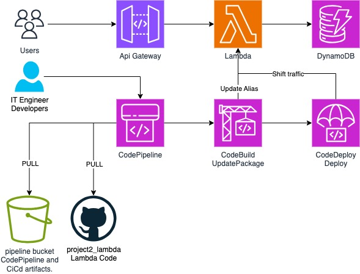

# Project 2 - Lambda
### 3 tier application (serverless/cloud-native) demo

Hello 👋, 

This repo is part of my second posted project, you can see my other projects here 👉 [medium.com](https://medium.com/@cristian.dente).

The walkthrough of this project is on [this link](https://medium.com/@cristian.dente/3-tier-serverless-app-using-aws-api-gateway-aws-lambda-and-aws-dynamodb-cicd-and-terraform-ad20b459ca9c).

This repo contains the lambda code used to query the data in dynamodb, and [this other repo](https://github.com/cdguru/project2_infrastructure_as_code), contains all the terraform IaC code to create all the resources for the demo.

This repo is called in the [terraform.tfvars](https://github.com/cdguru/project2_infrastructure_as_code/blob/master/terraform/terraform.tfvars) file on the other repo... All the details in the medium.com post ☝️.
